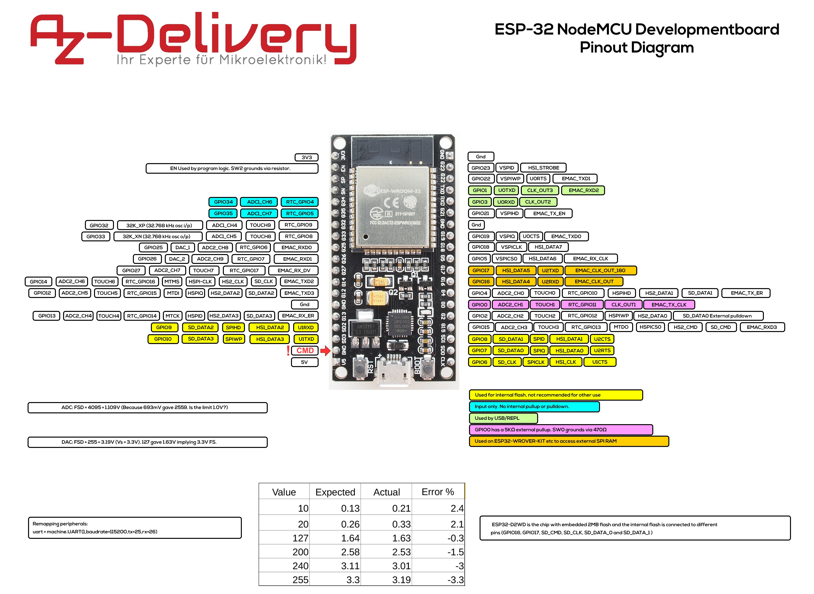

# Esp32-Ejemplos
Aqui hay toda clase de ejemplos para programar los esp32 desde Platform IO

## Contenido
- [Esp32 diagrama de pines](#esp32dev-board-pinmap)
- [Esp32 diagrama esquematico](#esp32dev-board-schematics)

### Esp32 diagrama de pines

### Esp32 diagrama esquematico

Installation instructions for using PlatformIO
=================================================

- [What is PlatformIO?](https://docs.platformio.org/en/latest/what-is-platformio.html?utm_source=github&utm_medium=arduino-esp32)
- [PlatformIO IDE](https://platformio.org/platformio-ide?utm_source=github&utm_medium=arduino-esp32)
- [PlatformIO Core](https://docs.platformio.org/en/latest/core.html?utm_source=github&utm_medium=arduino-esp32) (command line tool)
- [Advanced usage](https://docs.platformio.org/en/latest/platforms/espressif32.html?utm_source=github&utm_medium=arduino-esp32) -
  custom settings, uploading to SPIFFS, Over-the-Air (OTA), staging version
- [Integration with Cloud and Standalone IDEs](https://docs.platformio.org/en/latest/ide.html?utm_source=github&utm_medium=arduino-esp32) -
  Cloud9, Codeanywhere, Eclipse Che (Codenvy), Atom, CLion, Eclipse, Emacs, NetBeans, Qt Creator, Sublime Text, VIM, Visual Studio, and VSCode
- [Project Examples](https://docs.platformio.org/en/latest/platforms/espressif32.html?utm_source=github&utm_medium=arduino-esp32#examples)